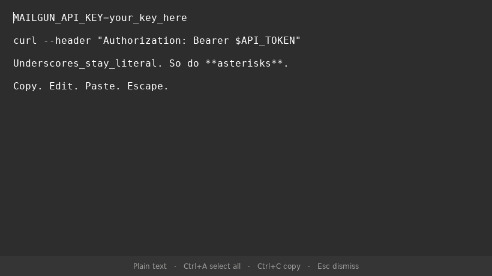

# Plainpad

A small, plain-text scratchpad for Omarchy. Copy some text, make a quick edit,
copy it back, and press Escape to return to what you were doing.



Underscores stay underscores. Markdown stays text. No syntax highlighting,
smart quotes, auto-indentation, file dialogs, or autosaving. Visual wrapping
never inserts newlines into your text.

Plainpad is an independent GTK application with Omarchy window rules, not an
Omarchy shell plugin. It is not affiliated with the Omarchy project.

## Install on Omarchy 4

Dependencies: Python 3.10+, PyGObject, and GTK 4.12+. On Omarchy/Arch:

```sh
omarchy pkg add python python-gobject gtk4
```

Then install this release for your user (no sudo):

```sh
git clone --branch v0.1.0 https://github.com/billerickson/plainpad.git
cd plainpad
./install.sh --omarchy
```

Open **Plainpad** in your application launcher or run `~/.local/bin/plainpad`.
The window opens centered and floating. **Super+T** can tile it normally.

The installer copies the app, launcher, desktop entry, icon, and window rule
into your user directories. It appends a marked block to `hypr/hyprland.lua`,
backs up that config first, and reloads/validates an active Hyprland session.
It never changes your keybindings. Existing files not owned by this installer,
and locally modified installed files, are preserved: installation stops with
an explanation instead of overwriting them.

To install just the GTK application, without changing Hyprland configuration:

```sh
./install.sh
```

Floating behavior requires the Omarchy rule or equivalent window-manager
configuration. Omarchy 3's older `.conf` syntax is not supported by
`--omarchy`. Tested on Omarchy 4.0.4 / Hyprland 0.56.2 / GTK 4.22, with
additional GTK checks in Ubuntu 24.04 / GTK 4.14.

## Optional shortcut

Check available bindings with `omarchy menu keybindings --print`. If **Super+E**
is unused, add this to `~/.config/hypr/bindings.lua`:

```lua
o.bind("SUPER + E", "Plainpad", o.shell_quote(os.getenv("HOME") .. "/.local/bin/plainpad"))
```

Then run `hyprctl reload` and `hyprctl configerrors`. Choose another shortcut
if Super+E is already in use. Reopening brings back the same window and draft.

## Use

| Shortcut | Action |
| --- | --- |
| Ctrl+A | Select all |
| Ctrl+C / Ctrl+V / Ctrl+X | Copy / paste / cut |
| Ctrl+Z | Undo |
| Ctrl+Shift+Z or Ctrl+Y | Redo |
| Escape or window close | Dismiss, keeping the draft in memory |
| Super+T (Omarchy) | Toggle floating / tiled |
| Ctrl+Q | Quit and discard the draft |

Typical workflow: **copy → open Plainpad → Ctrl+A → Ctrl+V → edit → Ctrl+A →
Ctrl+C → Escape → paste into your terminal**.

Drafts are **session-only**: Plainpad keeps running while dismissed, but quitting,
logging out, or restarting loses the draft. It does not save text to disk or
send it over the network. Copying is explicit; opening the app does not read
or replace your clipboard. Your desktop clipboard manager may retain copied
text according to its own settings.

## Update and uninstall

Quit Plainpad with Ctrl+Q before updating or uninstalling. From the checkout:

```sh
git fetch --tags
# Check out the release tag you want, then:
./install.sh --omarchy
```

For removal:

```sh
./uninstall.sh
```

Uninstall removes the installed files and its exact marked configuration block.
Other configuration and files stay in place. Remove any shortcut you added
manually. If an installed file or the managed block was edited, the installer
stops; move the edited file aside or restore the original block before retrying.
Keep the checkout to run updates/uninstall, or download the same release again.

Locations follow `XDG_DATA_HOME` and `XDG_CONFIG_HOME` (defaulting to
`~/.local/share` and `~/.config`). The executable is always
`~/.local/bin/plainpad`; add `~/.local/bin` to PATH to use `plainpad` by name.
There are no dependencies on the checkout after installation.

## Development

Run `/usr/bin/python3 plainpad.py` directly. No build step or pip packages are
needed; PyGObject and GTK come from the operating system.

```sh
python3 -m unittest discover -s tests -v
```

Installer tests need `desktop-file-validate` from `desktop-file-utils`. The GUI
smoke test uses a disposable X11 desktop and its own D-Bus session:

```sh
xvfb-run -a dbus-run-session -- python3 tests/gui_smoke.py
```

It needs `xvfb`, `xdotool`, `xclip`, and GTK/PyGObject. See
[verification notes](docs/verification.md) for the Wayland checks and release
scope. Bug reports and small, focused contributions are welcome on GitHub.

MIT licensed. Created by Bill Erickson.
